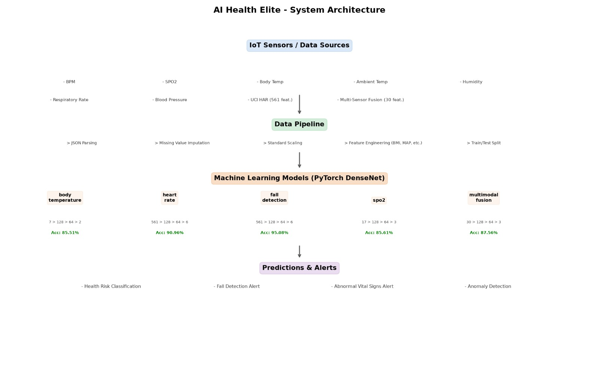
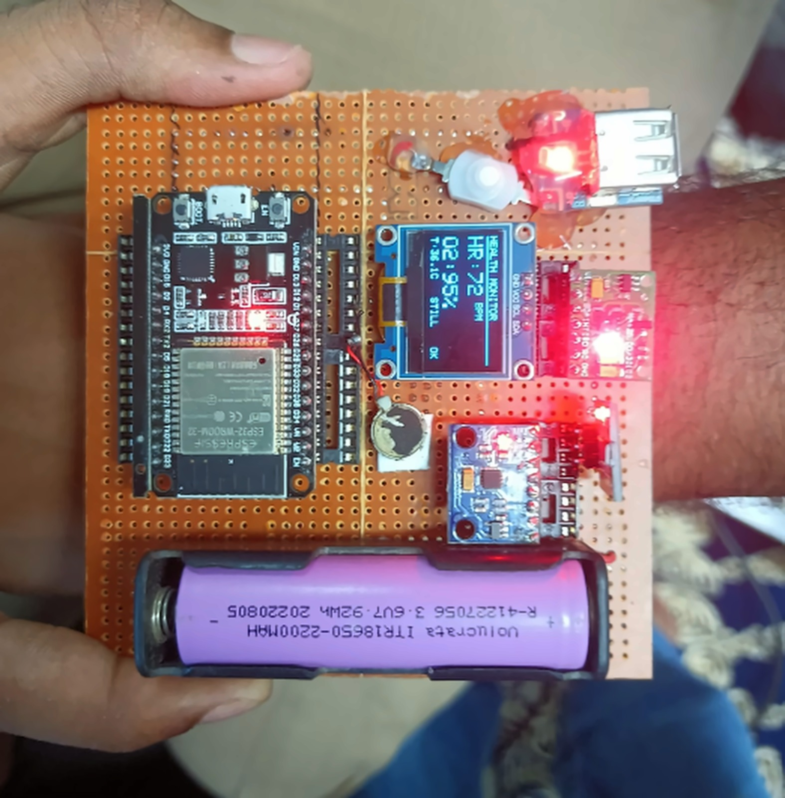
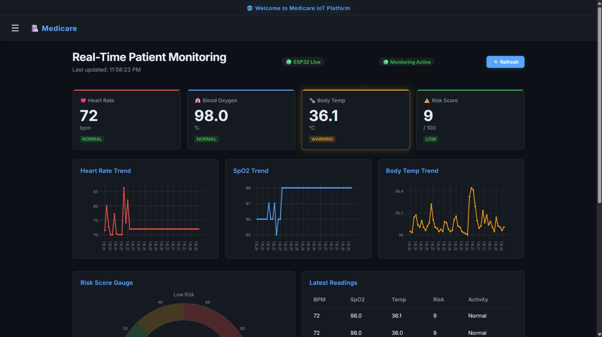

# 🩺 IoT Healthcare Monitoring System

<div align="center">


### Intelligent Edge–Cloud IoT Framework for Real-Time Physiological Monitoring and AI-Driven Health Risk Prediction

*An IoT-based smart healthcare system that continuously monitors physiological parameters, processes data at the edge, stores it in the cloud, and provides AI-powered health risk prediction through an interactive web dashboard.*

</div>

---

## 📖 Overview

Healthcare monitoring plays a crucial role in the early detection of medical emergencies. This project presents an intelligent IoT framework capable of collecting real-time physiological data from wearable sensors, transmitting it securely to the cloud, and providing AI-driven insights through an intuitive web application.

The system combines **Edge Computing**, **Cloud Computing**, **Machine Learning**, and **IoT technologies** to enable continuous remote patient monitoring.

---

## ✨ Features

- 📡 Real-time physiological data acquisition
- ❤️ Heart Rate Monitoring
- 🌡️ Body Temperature Monitoring
- 🩸 Blood Oxygen (SpO₂) Monitoring
- ☁️ Cloud Database Integration
- 📊 Interactive Dashboard
- 🤖 AI-Based Health Risk Prediction
- 📈 Live Sensor Visualization
- 📱 Responsive Web Interface
- 🔐 Secure Data Storage
- ⚡ Edge Computing for Faster Processing

---

## 🏗️ System Architecture

```
Wearable Sensors
        │
        ▼
     ESP32 Board
        │
        ▼
 Edge Processing
        │
        ▼
 WiFi Communication
        │
        ▼
 Cloud Database
        │
        ▼
 Flask Web Application
        │
        ▼
 AI Prediction Model
        │
        ▼
 Health Dashboard
```

---

## 🛠️ Technology Stack

### Hardware

- ESP32 Development Board
- MAX30102 Pulse Oximeter Sensor
- DS18B20 Temperature Sensor
- OLED Display
- Wi-Fi Module (Built-in ESP32)

### Software

- Python
- Flask
- HTML5
- CSS3
- JavaScript
- Arduino IDE / ESP-IDF

### Database

- Supabase / PostgreSQL

### Machine Learning

- Scikit-learn
- Pandas
- NumPy

### Deployment

- GitHub
- Vercel (Frontend)
- Flask Backend

---

## 📂 Project Structure

```
IoT/
│
├── ESP32/
│   ├── Sensor Code
│   ├── OLED Display
│   └── WiFi Communication
│
├── Backend/
│   ├── Flask
│   ├── APIs
│   ├── AI Model
│   └── Database
│
├── Frontend/
│   ├── HTML
│   ├── CSS
│   └── JavaScript
│
├── Images/
├── README.md
└── requirements.txt
```

---

## ⚙️ Working

1. ESP32 reads physiological sensor values.
2. Data is processed locally using edge computing.
3. The processed data is transmitted over Wi-Fi.
4. The backend stores the readings in the cloud database.
5. The AI model analyzes incoming health data.
6. The dashboard displays live readings and predictions.

---

## 📊 Parameters Monitored

| Parameter | Description |
|-----------|-------------|
| ❤️ Heart Rate | Beats Per Minute (BPM) |
| 🩸 SpO₂ | Blood Oxygen Saturation |
| 🌡️ Temperature | Body Temperature |
| 📈 Health Score | AI Predicted Health Risk |

---

## 🚀 Installation

Clone the repository

```bash
git clone https://github.com/sibap-dev/IoT.git
```

Navigate into the project

```bash
cd IoT
```

Install dependencies

```bash
pip install -r requirements.txt
```

Run the Flask server

```bash
python app.py
```

---

## 📸 Project Screenshots

### 🏗️ System Architecture

<p align="center">
  
</p>

*Overall architecture of the IoT Healthcare Monitoring System illustrating the data flow from sensors to the cloud and AI prediction.*

---

### 🔌 Hardware Setup

<p align="center">
  
</p>

*ESP32-based hardware setup with physiological sensors and OLED display.*

---

### 📊 Web Dashboard

<p align="center">
  
</p>

*Interactive web dashboard for real-time monitoring of sensor readings and AI-based health risk prediction.*

## 🔮 Future Improvements

- Mobile Application
- Emergency SMS Alerts
- ECG Signal Monitoring
- Blood Pressure Monitoring
- MQTT Communication
- Doctor Portal
- Patient History Analysis
- AI-Based Disease Detection
- Firebase Notifications
- Wearable Device Integration

---

## 🎯 Applications

- Smart Hospitals
- Remote Patient Monitoring
- Elderly Care
- Home Healthcare
- Telemedicine
- Health Analytics
- Medical Research

---

## 🤝 Contributors

- **Siba Prasad Padhi**
- Arnav Nayak
- Barsha Priyadarsini Rath
- Pawan Kumar Sahu
- Subhasis Padhy
- Rudra Narayan Behera
- Divyadarshee Dash

---

## 📜 License

This project is licensed under the MIT License.

---

## ⭐ Show Your Support

If you found this project useful, consider giving it a **⭐ Star** on GitHub.

It motivates us to build more impactful open-source projects.

---

<div align="center">

### Made with ❤️ by Team IoT

*"Innovating Healthcare Through Edge AI & IoT"*

</div>
